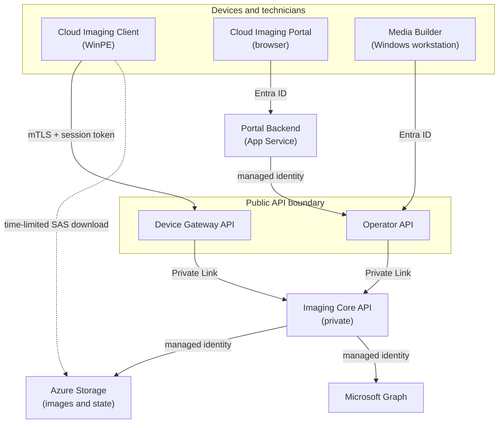

# Architecture overview

Cloud Imaging runs in your Azure tenant. Devices and technicians use separate public entry points, while the Imaging Core API remains private and owns session state, image metadata, and time-limited download access.

## Components

| Component | Runs in | Responsibility |
|---|---|---|
| **Cloud Imaging Client** | WinPE on the target device | Registers the device, downloads and applies the assigned image, and reports progress |
| **Cloud Imaging Media Builder** | Technician workstation | Builds WinPE images and prepares bootable USB media |
| **Cloud Imaging Portal** | Browser and Azure App Service | Couples devices, assigns images, monitors sessions, and manages catalogs and configuration |
| **Device Gateway API** | Azure Functions | Public device endpoint protected by mutual TLS and device-session tokens |
| **Operator API** | Azure Functions | Public operator endpoint protected by Microsoft Entra ID and app roles |
| **Imaging Core API** | Private Azure Functions endpoint | Owns session state, authorization, image catalogs, and shared access signature (SAS) issuance |

## Component interaction

## Imaging flow

1. Media Builder creates a WinPE boot image and prepares bootable USB media.
2. A device boots into the Cloud Imaging Client and registers through the Device Gateway API.
3. Imaging Core checks whether the device is authorized and returns a short-lived session token and coupling passcode.
4. A technician enters the passcode in the Portal and assigns an OS image.
5. The Client polls for its assignment, then downloads the image directly from Azure Storage using a time-limited SAS URL.
6. The Client prepares the disk, applies Windows, configures boot and recovery, and reports each stage through the Device Gateway API.
7. The Portal displays live progress and the terminal success or failure result.

## Security boundaries

- The **Device Gateway API** is the only API exposed to WinPE devices. It requires the boot-media certificate for mutual TLS and validates device-session tokens.
- The **Operator API** accepts technician and Portal traffic. Microsoft Entra ID authentication and app roles determine available operations.
- The **Imaging Core API** is not internet-facing. Device Gateway and Operator API reach it through Private Link.
- Workloads use **managed identities** for Azure service access. Deployment does not require storage account keys in application configuration.
- Image downloads use **short-lived SAS URLs**. The Client receives access to its assigned image instead of broad storage credentials.

For deployment details, continue with [Setup instructions](setup-instructions.md). For permissions, see [Roles and access](roles-and-access.md). For runtime diagnosis, see the [Operations runbook](operations-runbook.md).