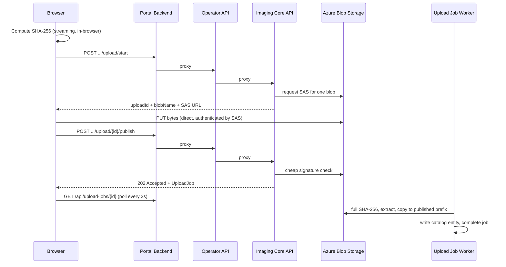

# Image Upload Pipeline

How OS images, boot images, and recovery images get from a browser into the Cloud Imaging
catalog. This page covers the mechanism rather than the click path; for the operator-facing
steps, see [setup-instructions.md](setup-instructions.md).

---

## 1. The shape of every upload

All three upload flows share one principle: **the file bytes never pass through any Cloud Imaging
API**. The APIs broker a short-lived, narrowly scoped credential, and the browser talks to Azure
Blob Storage directly.



Why it is built this way:

- **Function apps are not file servers.** Streaming multi-gigabyte WIMs through an Azure Function
  would hit request size and timeout limits, and would pay for the same bytes twice.
- **The credential is scoped to a single blob.** A leaked SAS grants write access to one blob that
  the service has already named, for a few hours, with no read, list, or delete rights.
- **Verification is server-side.** A browser-supplied hash is a hint, not a guarantee, so the
  worker recomputes it from the stored bytes before anything enters the catalog.

### The four-hop API chain

Every request crosses four boundaries before reaching storage:

| Hop | Component | Responsibility |
|---|---|---|
| 1 | **Portal Backend** (Node/Express) | Validates the signed-in user's `CloudImaging.Administrator` role. Holds no storage credentials. |
| 2 | **Operator API** (Functions) | Service-level role check (`CloudImaging.PortalAccess`), then proxies to Core. Not reachable from the internet by users. |
| 3 | **Imaging Core API** (Functions) | Owns storage. Names blobs, mints SAS, validates, writes catalog entities. |
| 4 | **Azure Blob Storage** | Holds the bytes. |

The Portal Backend authenticates to the Operator API with **its own managed identity** via
`DefaultAzureCredential`. This is not an on-behalf-of exchange: the browser's user token stops at
the Portal Backend, which is where user role enforcement happens. The Operator API only ever sees
the portal's service identity. See [roles-and-access.md](roles-and-access.md).

---

## 2. Client-side hashing

Before any network call, the browser computes the file's SHA-256. This happens in
`src/cloud-imaging-portal/client/src/lib/sha256.ts` using the
[`hash-wasm`](https://www.npmjs.com/package/hash-wasm) package, reading the file in 8 MiB slices
via `File.slice()` so a 20 GB WIM never lands in memory at once.

The Web Crypto API (`crypto.subtle.digest`) is deliberately not used here: it has no streaming
interface, so it would require buffering the entire file.

Hashing is a distinct, visible progress phase in the UI because on large files it is not instant.
The resulting hash is sent with the start request and carried through to the worker, which
recomputes it independently and compares.

---

## 3. Blob naming and SAS

The Imaging Core API names every blob. The client never chooses a path, which is what makes a
single-blob SAS safe to hand out.

| Asset | Container | Staged path | Published path |
|---|---|---|---|
| OS image | `os-images` | `uploads/<uploadId>/<name>-<version><ext>` | `published/<guid>/<name>-<version><ext>` |
| Boot image | `boot-images` | `uploads/<uploadId>/<version>.wim` | `published/<guid>/<version>.wim` |
| Recovery image | `recovery-images` | `uploads/<uploadId>/winre-<version>.wim` | `published/<guid>/winre-<version>.wim` |

Nothing is ever written straight to `published/`. A file lives under `uploads/` until it has been
verified, and promotion to `published/` is the act that makes it real.

SAS tokens are minted by
`src/CloudImaging.ImagingCoreApi/Services/BlobSasUrlGenerator.cs`:

- **Permissions**: `Create | Write` only. No read, no list, no delete.
- **Scope**: exactly one blob, named by the service.
- **Lifetime**: 24 hours for OS images (resumable, so longer), 4 hours for boot and recovery.
- **Signing**: a **User Delegation SAS** in Azure, signed with a key obtained by the Core
  function's managed identity, so the SAS is bound to that identity and dies with it. Locally, it
  falls back to a shared-key SAS. This requires **Storage Blob Data Owner** on the Core managed
  identity, since minting a user delegation key is an owner-level operation.

---

## 4. OS images: resumable block upload

OS images are the only flow with chunking, because they are the only flow where the file is
routinely tens of gigabytes.

**UI**: `src/cloud-imaging-portal/client/src/pages/OsImagesPage.tsx` opens
`src/cloud-imaging-portal/client/src/components/ChunkedUploadDialog.tsx`.
**Transport**: `src/cloud-imaging-portal/client/src/services/chunkedUploadService.ts`.

Accepted extensions: `.wim` and `.iso`. Validation is filename-based; MIME type is not inspected.

### Block staging

The client uses the Azure Blob **Put Block / Put Block List** protocol by hand over
`XMLHttpRequest`. There is no `@azure/storage-blob` dependency in the portal client.

- Block size is **8 MiB**, set server-side by `UploadBlockSizeBytes` in
  `src/CloudImaging.ImagingCoreApi/Functions/OsImageUploadFunctions.cs`
  and returned in the start response, so it can change without a client release.
- Blocks upload **sequentially**, one at a time.
- Block IDs are deterministic and positional: `btoa(String(index).padStart(6, '0'))`. Determinism
  is what makes resume possible, since the client can reconstruct the staged list from a count
  alone.
- Each block is a `PUT` to the SAS URL with `comp=block` and `blockid=<id>` appended.

This yields the practical size ceiling. Azure permits 50,000 blocks per blob, so 50,000 x 8 MiB is
roughly **400 GB** of addressable capacity, far above any realistic Windows image. There is no
explicit byte-size limit enforced in code on either side.

### Resume

A checkpoint is written to `localStorage` under `ci-os-image-upload-session`, holding the SAS
session, block size, staged block count, and the file's name, size, and `lastModified`.

The `File` handle itself cannot be persisted, so resume is semi-automatic: the operator reselects
the file, and the client matches it on name, size, and `lastModified` before offering to continue.
A mismatch, or an expired SAS, discards the checkpoint and restarts.

Explicitly abandoning an upload calls `POST /api/images/upload/{uploadId}/abandon`, which deletes
the staged blob through Core rather than leaving orphaned blocks to age out.

### Known limits of the transport

There is no per-block retry and no exponential backoff. A failed block fails the upload, and the
operator resumes from the checkpoint. This is a deliberate simplification, not an oversight, but
it does mean a flaky link produces visible failures rather than silent recovery.

### ISO handling

An uploaded `.iso` is not what ends up in the catalog. During the publish phase,
`src/CloudImaging.ImagingCoreApi/Services/UploadPublishService.cs`
streams the ISO and extracts `sources\install.wim` or `sources\install.esd` using `DiscUtils`
(ISO 9660 and UDF). The extracted image becomes the catalog blob; the ISO is discarded. This is
the **Extracting** stage that appears in the progress UI for ISO uploads only.

---

## 5. Boot and recovery images: single PUT

Boot and recovery images are WinPE and WinRE images, typically well under a gigabyte, so they
skip chunking entirely.

**Boot**: `src/cloud-imaging-portal/client/src/pages/BootImagesPage.tsx` with
`src/cloud-imaging-portal/client/src/services/bootImageUploadService.ts`.
**Recovery**: `src/cloud-imaging-portal/client/src/pages/RecoveryImagesPage.tsx` with
`src/cloud-imaging-portal/client/src/services/recoveryImageUploadService.ts`.

Both accept `.wim` only and perform one whole-file `PUT` to the SAS URL:

```http
PUT <blob SAS URL>
x-ms-blob-type: BlockBlob
Content-Type: application/octet-stream
```

Progress comes from the native `xhr.upload.progress` event. There is no chunking, no parallelism,
no retry, and no resume. A failed upload is retried from the beginning.

### Where boot images come from

The Media Builder **generates** boot images locally; it does not publish them. It writes a WIM such
as `cloud-imaging-boot-<timestamp>.wim` to disk, computes a SHA-256, and instructs the operator to
upload it through the portal. The portal upload is the only publication path, and it is the only
one that verifies the file before the catalog can point at it.

The version field can be prefilled from the Media Builder's timestamped filename, which is the only
coupling between the two.

### Signature validation

Unlike OS images, the publish request for boot and recovery images performs an immediate
**magic-byte check** before returning: it reads the blob header and requires the WIM signature
`MSWIM\0\0\0`
(`src/CloudImaging.ImagingCoreApi/Services/BootImageValidationService.cs`).
A file that is not a WIM is deleted from storage and the request returns `422 Unprocessable
Entity`, so an obviously wrong file fails in seconds rather than after a full hash pass.

---

## 6. The upload job worker

Publish returns `202 Accepted` immediately. The expensive work runs asynchronously, because
rehashing a 20 GB blob does not fit in an HTTP request.

State lives in Azure Table Storage (`UploadJobs`, partition `job`, row `uploadId`), modelled by
`src/CloudImaging.Contracts/Models/UploadJob.cs`.

**Status**: `Pending` -> `Processing` -> `Completed` | `Failed`
**Stage**: `Queued` -> `Verifying` -> `Extracting` (OS ISO only) -> `Publishing`

The worker is a timer trigger in
`src/CloudImaging.ImagingCoreApi/Functions/UploadJobFunctions.cs` firing
every **15 seconds**:

1. Claims a pending job using an **ETag-based lease** so concurrent function instances cannot both
   process the same job.
2. Holds a **60-minute lease**, renewed on each progress report. The host timeout is one hour.
3. Recomputes the **full SHA-256** from the stored blob and compares it to the browser's value.
   On mismatch, the staged blob is deleted and the job fails.
4. Extracts `install.wim`/`install.esd`, for ISO uploads only.
5. Copies the blob to the `published/` prefix and deletes the staged source.
6. Writes the catalog entity.
7. Marks the job `Completed`.

Reliability behaviours:

- Jobs whose lease expired are **reclaimed**, retried up to **three attempts**.
- Terminal jobs are **purged after seven days** by a separate daily timer (`0 0 3 * * *`).
- Progress writes are throttled to at most one every two seconds by
  `src/CloudImaging.ImagingCoreApi/Services/UploadJobProgressReporter.cs`,
  so a fast hash pass cannot hammer Table Storage.

The browser polls `GET /api/upload-jobs/{uploadId}` every three seconds via
`src/cloud-imaging-portal/client/src/services/uploadJobService.ts`,
tolerating up to five consecutive transient failures before giving up, so a brief blip does not
abandon a job that is still running fine server-side.

---

## 7. Catalog retention

Retention differs sharply by asset type, and it is enforced in the repository layer, not the UI.

| Asset | Max active entries | Behaviour at the limit |
|---|---|---|
| OS images | **500** | Publish is **rejected**. Checked twice: before block-list commit, and again in the worker. |
| Boot images | **5** | Publish **succeeds**; the oldest active entry is demoted to inactive. |
| Recovery images | **5** | Same rotation as boot images. |

For boot and recovery images, the newest entry becomes `IsLatestPublished = true` and the previous
holder is demoted. That flag is what the Media Builder's Prepare USB workflow resolves when it
offers "the latest published boot image".

Catalog entities live in Azure Table Storage, all under partition key `catalog`:

| Entity | Table |
|---|---|
| `OsImage` | `OSImages` |
| `BootImage` | `BootImages` |
| `RecoveryImage` | `RecoveryImages` |

---

## 8. Authorization summary

| Operation | Required role | Enforced by |
|---|---|---|
| Read any catalog | `CloudImaging.Reader` and above | Portal Backend |
| Start, publish, abandon, delete an upload | `CloudImaging.Administrator` | Portal Backend |
| Poll an upload job | `CloudImaging.Administrator` | Portal Backend |
| Portal Backend to Operator API | `CloudImaging.PortalAccess` | `AppRoleAuthorizationMiddleware` |

`CloudImaging.MediaBuilderAccess` is a **read-only** service role and cannot reach any upload
endpoint. The Media Builder consumes published images; it never publishes them.

Operator API function triggers are declared `AuthorizationLevel.Anonymous`. That is not a gap:
authentication and authorization are applied in the worker middleware pipeline
(`EntraAuthMiddleware`, then `AppRoleAuthorizationMiddleware`) rather than by function keys.

---

## 9. Failure modes

| Symptom | Cause | Where it surfaces |
|---|---|---|
| `422` immediately on publish | File is not a WIM (magic-byte check) | Boot and recovery only |
| Job fails at **Verifying** | Server hash does not match the browser's; bytes were corrupted in transit | Worker; staged blob is deleted |
| Job fails at **Extracting** | ISO contains no `sources\install.wim` or `.esd` | OS ISO only |
| Job fails at **Publishing** | OS catalog is at 500 active entries | Worker |
| Upload stops partway | A block `PUT` failed; there is no automatic retry | Resume from the `localStorage` checkpoint (OS), or restart (boot/recovery) |
| Resume not offered | Reselected file differs in name, size, or `lastModified`, or the SAS expired | Checkpoint is discarded |
| `403` on the SAS `PUT` | SAS expired (24h OS, 4h boot/recovery) | Restart the upload to mint a fresh SAS |

Staged blobs from abandoned uploads are removed on explicit abandon and on validation failure.
There is no timer that sweeps `uploads/` prefixes left behind by a browser that simply closed, so
consider a storage lifecycle rule on the `uploads/` prefix if that accumulates.

---

## 10. Deployment prerequisites

`src/deploy/bicep/modules/storage.bicep` provisions the blob containers: `os-images`,
`boot-images`, `recovery-images`, `branding`, `app-packages`, and `session-logs`. Table Storage
tables are created on demand by the repositories (`CreateIfNotExistsAsync`), but **blob containers
are not** created at runtime, so a container missing from the template means uploads of that asset
type fail outright.

The Core managed identity needs **Storage Blob Data Owner** on the Core storage account, not merely
Contributor, because minting a User Delegation SAS requires it.
