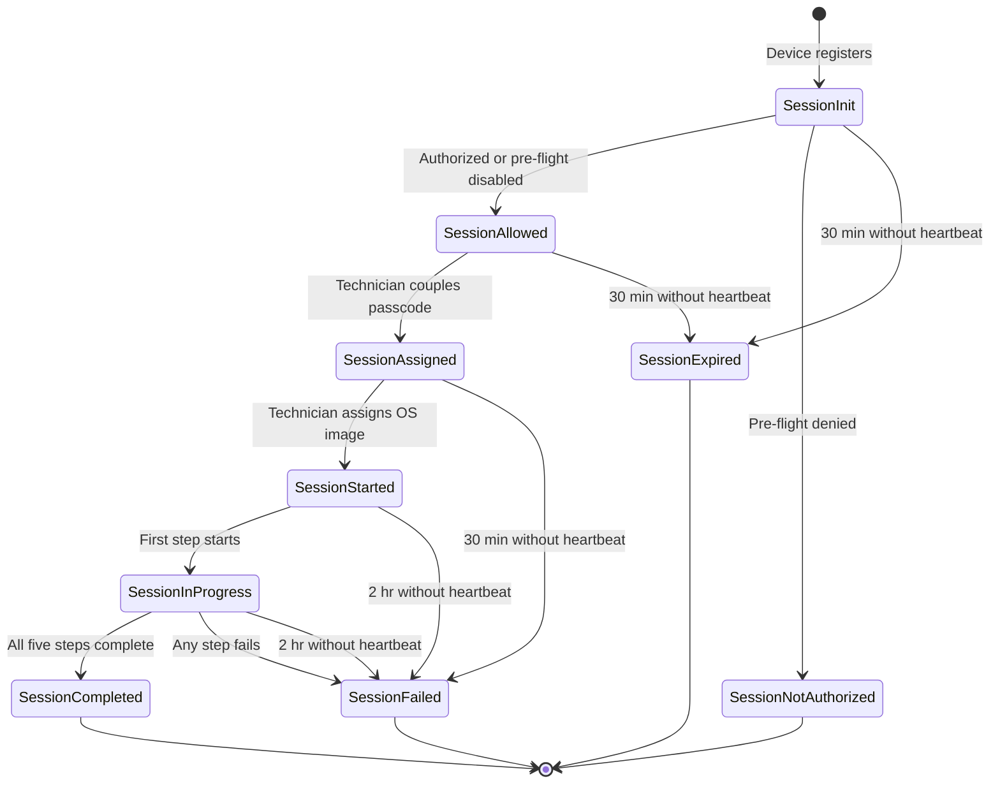
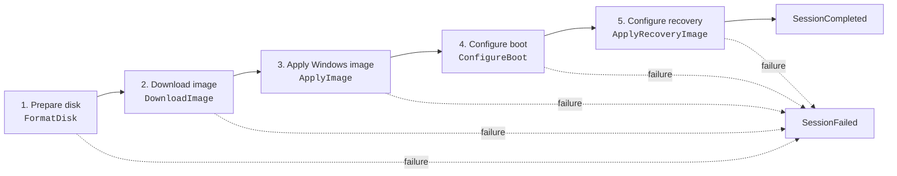

# Session lifecycle

A session represents one attempt to image one device. Imaging Core owns its state, while the Client and Portal drive transitions through the Device Gateway and Operator APIs.

## State diagram

This diagram is adapted from the engineering sequence diagrams and aligned with the current implementation.

`SessionInit` is the initial state while pre-flight authorization is evaluated. The persisted session normally reaches `SessionAllowed` or `SessionNotAuthorized` as part of registration.

## State reference

| State | Meaning | Next state |
|---|---|---|
| `SessionInit` | Registration and pre-flight authorization are being evaluated | `SessionAllowed`, `SessionNotAuthorized`, or `SessionExpired` |
| `SessionAllowed` | Device may be imaged and is waiting for its passcode to be coupled | `SessionAssigned` or `SessionExpired` |
| `SessionAssigned` | Passcode was consumed; device is coupled but has no OS image yet | `SessionStarted` or `SessionFailed` after inactivity |
| `SessionStarted` | Technician assigned an active OS image and Imaging Core issued its download URL | `SessionInProgress` or `SessionFailed` |
| `SessionInProgress` | At least one imaging step started | `SessionCompleted` or `SessionFailed` |
| `SessionCompleted` | All five imaging steps completed | Terminal |
| `SessionFailed` | An imaging step failed, or a coupled/started session exceeded its inactivity limit | Terminal |
| `SessionNotAuthorized` | Enabled pre-flight authorization did not find an allowed device record | Terminal |
| `SessionExpired` | An uncoupled session timed out without becoming an operator-visible failure | Terminal |

Coupling and OS image assignment are separate actions. Coupling changes `SessionAllowed` to `SessionAssigned`; assignment then changes `SessionAssigned` to `SessionStarted` immediately.

An operator can remove a coupled session only while it is `SessionAssigned`. This deletes the abandoned record; it is not another session state. Once an image is assigned, the session follows the normal terminal lifecycle so diagnostic history is retained.

## Imaging stages

Each stage reports `Pending`, `InProgress`, `Completed`, or `Failed`. Imaging Core calculates overall progress from all five stages. The session enters `SessionInProgress` as soon as the first stage starts, even when its percentage is still 0.

## Heartbeats and timeouts

The Client polls or reports progress while it is running. Successful status polls and progress reports refresh the session heartbeat.

| Session condition | Maximum heartbeat silence | Result |
|---|---:|---|
| Not yet imaging: `SessionInit`, `SessionAllowed`, or `SessionAssigned` | 30 minutes | Uncoupled sessions become `SessionExpired`; coupled sessions become `SessionFailed` |
| Imaging: `SessionStarted` or `SessionInProgress` | 2 hours | Session becomes `SessionFailed` |

The lifecycle timer evaluates sessions every five minutes, so a transition can occur after the threshold rather than at its exact second.

Live terminal session records are retained for 24 hours. Separate reporting history uses the configured **Session history retention** period, which defaults to 90 days.

See [Troubleshooting index](troubleshooting-index.md) when a session does not make the expected transition.