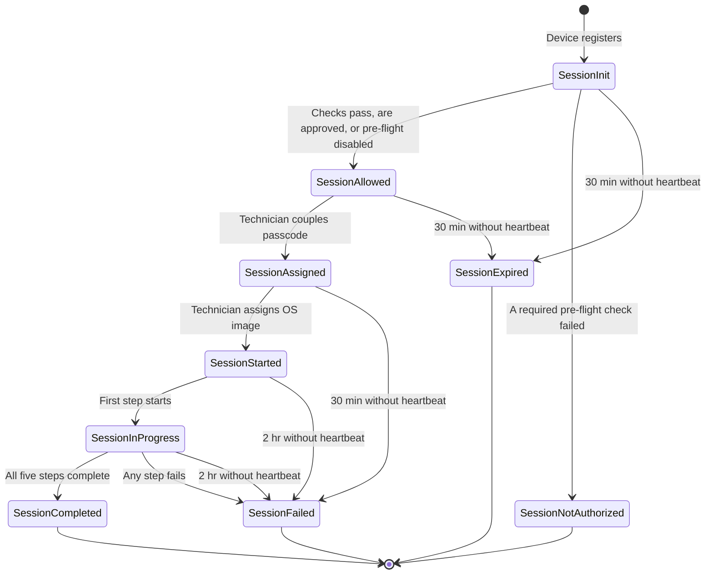
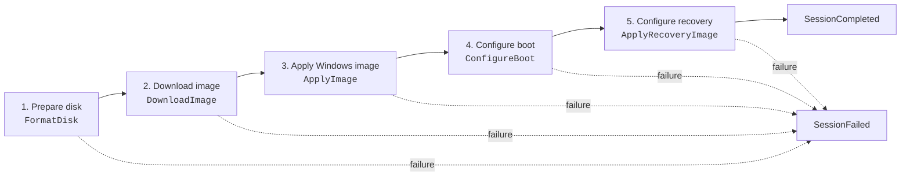

# Session lifecycle

A session represents one attempt to image one device. Imaging Core owns its state, while the Client and Portal drive transitions through the Device Gateway and Operator APIs.

## State diagram

This diagram is adapted from the engineering sequence diagrams and aligned with the current implementation.

```mermaid
stateDiagram-v2
    [*] --> SessionInit: Device registers
    SessionInit --> SessionAllowed: Checks pass, are approved, or pre-flight disabled
    SessionInit --> SessionNotAuthorized: A required pre-flight check failed

    SessionAllowed --> SessionAssigned: Technician couples passcode
    SessionAssigned --> SessionStarted: Technician assigns OS image
    SessionStarted --> SessionInProgress: First step starts
    SessionInProgress --> SessionCompleted: All five steps complete
    SessionInProgress --> SessionFailed: Any step fails

    SessionInit --> SessionExpired: 30 min without heartbeat
    SessionAllowed --> SessionExpired: 30 min without heartbeat
    SessionAssigned --> SessionFailed: 30 min without heartbeat
    SessionStarted --> SessionFailed: 2 hr without heartbeat
    SessionInProgress --> SessionFailed: 2 hr without heartbeat

    SessionCompleted --> [*]
    SessionFailed --> [*]
    SessionNotAuthorized --> [*]
    SessionExpired --> [*]
```

`SessionInit` is the initial state while pre-flight authorization is evaluated. The persisted session normally reaches `SessionAllowed` or `SessionNotAuthorized` as part of registration.

## State reference

| State | Meaning | Next state |
|---|---|---|
| `SessionInit` | Registration and pre-flight authorization are being evaluated | `SessionAllowed`, `SessionNotAuthorized`, or `SessionExpired` |
| `SessionAllowed` | Device may be imaged and is waiting for its passcode to be coupled | `SessionAssigned` or `SessionExpired` |
| `SessionAssigned` | Passcode was consumed; device is coupled but has no OS image yet | `SessionStarted` or `SessionFailed` after inactivity |
| `SessionStarted` | Technician assigned an active OS image and Imaging Core issued its download URL | `SessionInProgress` or `SessionFailed` |
| `SessionInProgress` | At least one imaging step started | `SessionCompleted` or `SessionFailed` |
| `SessionCompleted` | All five imaging steps completed | Terminal |
| `SessionFailed` | An imaging step failed, or a coupled/started session exceeded its inactivity limit | Terminal |
| `SessionNotAuthorized` | A required pre-flight check failed (listed under **Devices › Blocked**) | Terminal |
| `SessionExpired` | An uncoupled session timed out without becoming an operator-visible failure | Terminal |

Coupling and OS image assignment are separate actions. Coupling changes `SessionAllowed` to `SessionAssigned`; assignment then changes `SessionAssigned` to `SessionStarted` immediately.

An operator can remove a coupled session only while it is `SessionAssigned`. This deletes the abandoned record; it is not another session state. Once an image is assigned, the session follows the normal terminal lifecycle so diagnostic history is retained.

## Pre-flight checks

The Client reports the device's firmware mode, Secure Boot state and TPM version when it registers. Imaging Core evaluates every check once, when the session is created, and stores the result on the session. Later configuration changes never re-evaluate an existing session.

| Check | Passes when | Requirement switch |
|---|---|---|
| Autopilot presence | The serial is registered in Windows Autopilot or imported as a Corporate Identifier | Require Autopilot presence |
| Firmware mode | The device booted WinPE in UEFI mode | Require UEFI firmware mode |
| Secure Boot | Secure Boot is enforcing. Setup mode (no platform key) and unsupported firmware count as not enabled | Require Secure Boot |
| TPM version | The firmware exposes a TPM 2.0 (ACPI `TPM2` table). A TPM disabled in firmware counts as missing | Require TPM 2.0 |

A check blocks only while **Require pre-flight authorization** and its own requirement switch are both on. Saving the main switch on with no requirement selected is rejected. A required check also fails when the device sent no value (boot media older than this feature, shown as *Not reported*) or could not read it (*Could not be detected*; the reason is in the Client log).

A blocked device shows **Device Blocked** with one line per required check. The fix for each failed check is written to the Client log, opened with **View Log**. **Try again** starts a new session without a reboot.

### Administrator overrides

An Administrator can approve a blocked session from **Devices › Blocked**. The approval is a one-time pass for the same serial number:

- It covers exactly the checks that failed on the approved session. Any other failed check still blocks.
- The next session the device starts within 7 days uses it, and the pass is then deleted. Two sessions starting at once cannot both use it.
- Active passes are listed under **Devices › Overrides**, where they can be revoked. Expired passes are purged by the lifecycle timer.
- The session that used the pass records each covered check as *Approved* with the approver's name.

The Overrides tab and the Approve action are hidden while pre-flight authorization is off. Unused passes keep their expiry while hidden.

## Imaging stages

```mermaid
flowchart LR
    Format["1. Prepare disk<br/><code>FormatDisk</code>"] --> Download["2. Download image<br/><code>DownloadImage</code>"]
    Download --> Apply["3. Apply Windows image<br/><code>ApplyImage</code>"]
    Apply --> Boot["4. Configure boot<br/><code>ConfigureBoot</code>"]
    Boot --> Recovery["5. Configure recovery<br/><code>ApplyRecoveryImage</code>"]
    Recovery --> Complete["SessionCompleted"]

    Format -. failure .-> Failed["SessionFailed"]
    Download -. failure .-> Failed
    Apply -. failure .-> Failed
    Boot -. failure .-> Failed
    Recovery -. failure .-> Failed
```

Each stage reports `Pending`, `InProgress`, `Completed`, or `Failed`. Imaging Core calculates overall progress from all five stages. The session enters `SessionInProgress` as soon as the first stage starts, even when its percentage is still 0.

### Disk layout and firmware mode

Before touching the disk, the Client detects how the firmware booted WinPE and lays the configured partitioning scheme out to match:

| Firmware mode | Partition table | System partition | MSR | Recovery partition | Boot files |
|---|---|---|---|---|---|
| UEFI | GPT | EFI System Partition (FAT32) | Created | GPT attributes `0x8000000000000001` | `bcdboot /f UEFI` |
| Legacy BIOS (CSM) | MBR | Active primary partition (NTFS), same size as the EFI entry | Skipped | Type `0x27` | `bcdboot /f BIOS` |

MBR addresses at most 2 TiB; space beyond that stays unallocated and the Client logs a warning. If the firmware mode cannot be detected, the Format stage fails with stage code `FWM` and the disk is not changed.

## Heartbeats and timeouts

The Client polls or reports progress while it is running. Successful status polls and progress reports refresh the session heartbeat.

| Session condition | Maximum heartbeat silence | Result |
|---|---:|---|
| Not yet imaging: `SessionInit`, `SessionAllowed`, or `SessionAssigned` | 30 minutes | Uncoupled sessions become `SessionExpired`; coupled sessions become `SessionFailed` |
| Imaging: `SessionStarted` or `SessionInProgress` | 2 hours | Session becomes `SessionFailed` |

The lifecycle timer evaluates sessions every five minutes, so a transition can occur after the threshold rather than at its exact second.

Live terminal session records are retained for 24 hours. Separate reporting history uses the configured **Session history retention** period, which defaults to 90 days.

See [Troubleshooting index](troubleshooting-index.md) when a session does not make the expected transition.