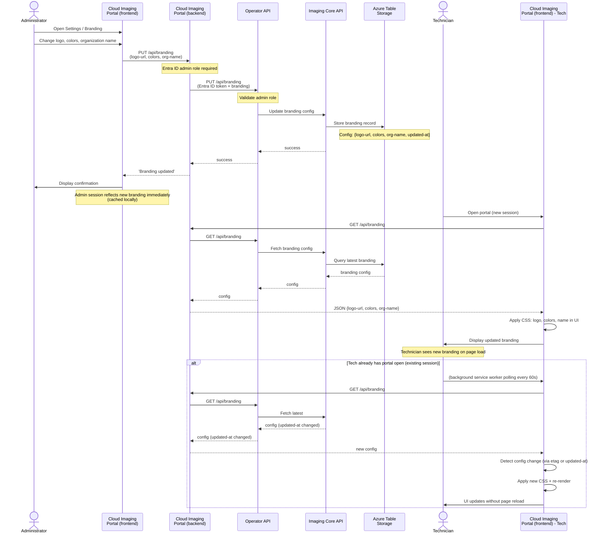

# Branding Update and Runtime Refresh

Administrator configures branding, portal backend persists via Operator API, and users fetch on next page load with auto-update.

## Branding Configuration

| Field | Type | Scope |
|-------|------|-------|
| Logo URL | String | Global, all users |
| Colors | CSS Map | Global, all users |
| Organization Name | String | Global, all users |
| Updated At | Timestamp | Track version |

## Caching & Refresh

- **On page load**: Fetch latest branding config from backend
- **In-session polling**: Background worker polls every 60 seconds for changes
- **Change detection**: Compare updated-at timestamp or etag
- **Auto-update**: Re-apply CSS and re-render on change without page reload
