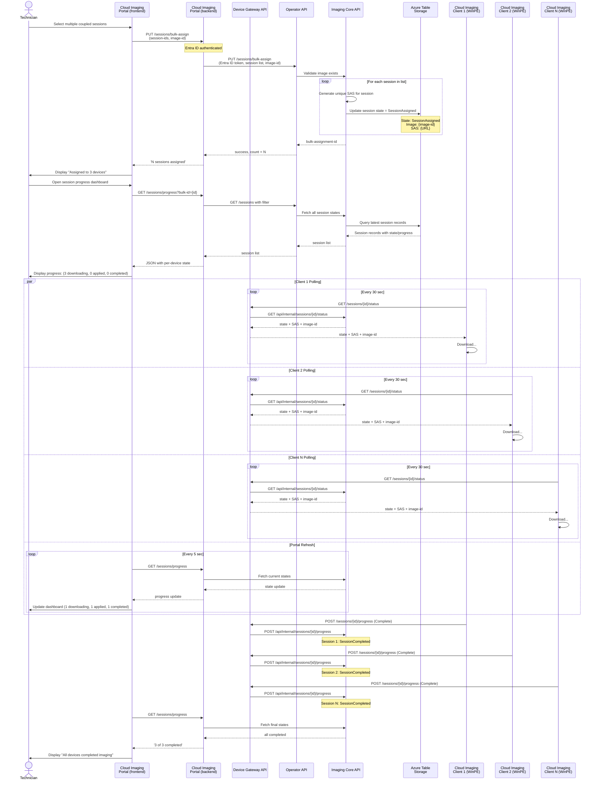

# Bulk Assignment and Dashboard Updates

Portal bulk-selects sessions, assigns one OS image to multiple devices, and displays per-device progress in real-time.

## Bulk Operations

- **Atomic assignment**: All N sessions updated in single transaction
- **Per-device SAS**: Each device gets unique SAS URL
- **Dashboard refresh**: 5-second polling for real-time progress
- **Concurrent polling**: All clients poll independently every 30 sec
- **Progress states**: Downloading, Applied, Completed tracked per-device
