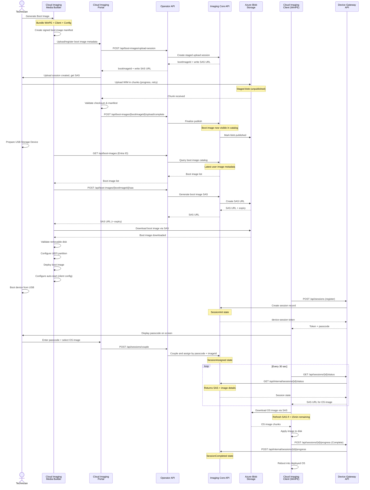

# Boot Image Generation, Upload, and Device Imaging

Complete sequence showing boot image creation, manifest signing, portal upload (chunked with progress/retry), finalization, device deployment, and USB preparation.

## Key Flows

- **Boot Image Lifecycle**: Generation → metadata registration → staged upload → validation → publish commit
- **Device Imaging**: Register session → couple → assign image → poll → download → apply → reboot
- **USB Preparation**: Query boot images → get SAS → download → validate disk → deploy
- **Staged Visibility**: Boot image remains unpublished until finalize succeeds
