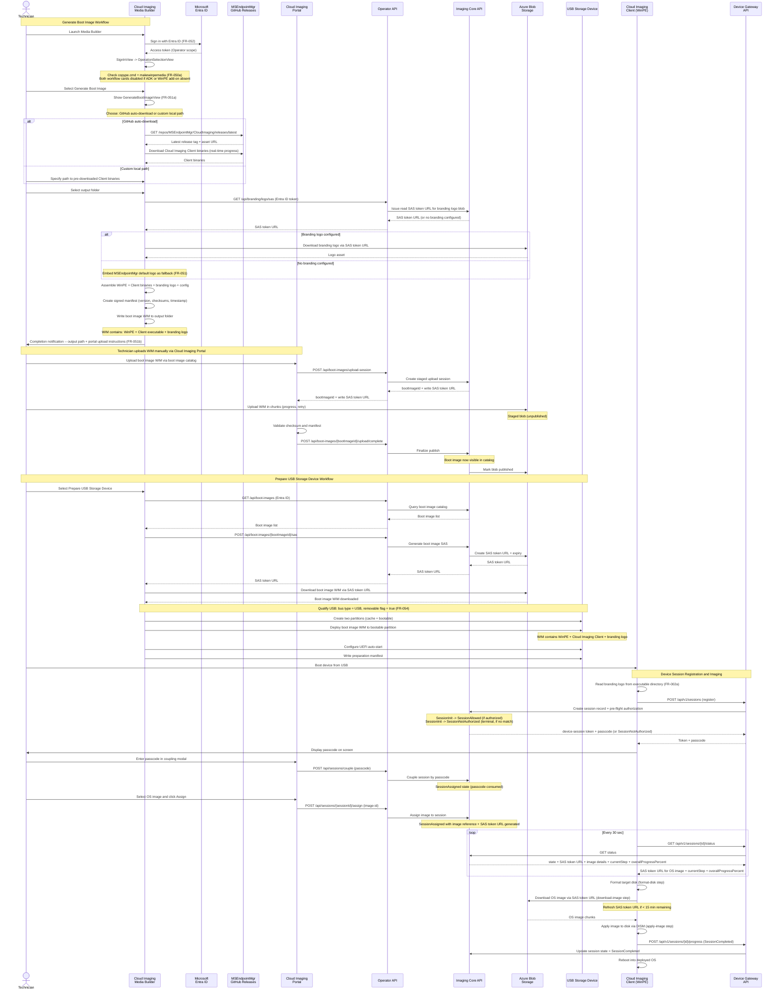

# Boot Image Generation, Upload, and Device Imaging

Complete sequence showing Media Builder sign-in, boot image creation with branding embed, manual portal upload, USB preparation, device session registration, coupling, and imaging.

## Key Flows

- **Generate Boot Image**: Sign in -> ADK check -> source selection (GitHub or custom path) -> branding retrieval from Operator API -> WIM assembly with branding logo -> completion notification with output path
- **Portal Upload**: Manual step by technician via Cloud Imaging Portal boot image catalog (Media Builder does not upload)
- **Prepare USB**: Query boot images -> get SAS -> download WIM -> qualify USB (bus type = USB + removable flag) -> deploy WIM
- **Device Session**: Register -> pre-flight authorization -> passcode display -> couple -> assign -> poll (with currentStep + overallProgressPercent) -> format -> download -> apply -> reboot
- **Branding**: Retrieved from Operator API and embedded in boot image WIM during Generate Boot Image; Client reads from executable directory at startup (FR-002a, FR-051)
