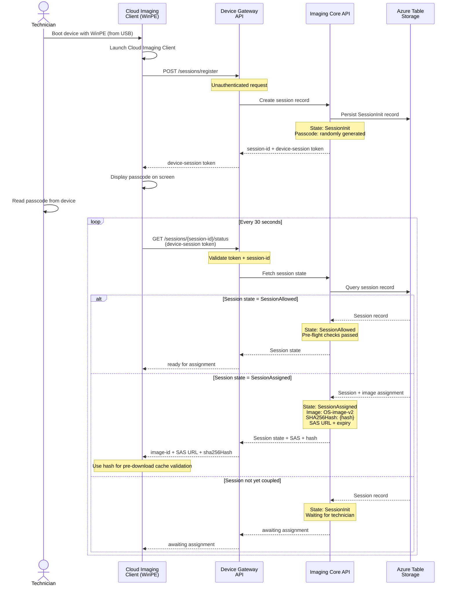

# Device Session Initialization and Polling

Device bootstrap, session registration, passcode display, and polling for assignment.

## Session State Transitions

| State | Condition | Next State |
|-------|-----------|-----------|
| SessionInit | Session registered, awaiting passcode | SessionAllowed (after couple) |
| SessionAllowed | Pre-flight checks passed | SessionAssigned (after image select) |
| SessionAssigned | Image assigned, SAS issued | SessionInProgress (on client poll) |
| SessionInProgress | Client downloading/applying | SessionCompleted (on finish) |
| SessionCompleted | Imaging done, device reboots | (end) |
