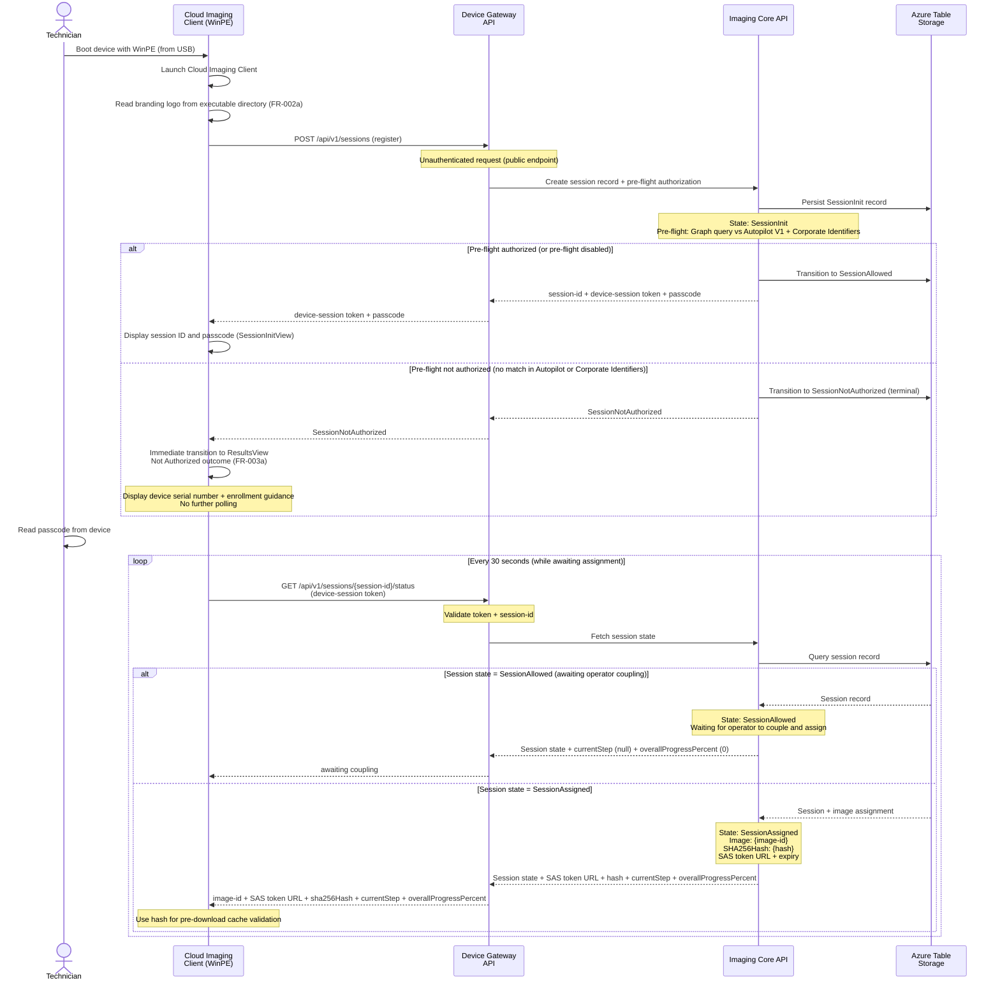

# Device Session Initialization and Polling

Device bootstrap, session registration, passcode display, and polling for assignment.

## Session State Transitions

| State | Condition | Next State |
|-------|-----------|-----------|
| SessionInit | Session registered; pre-flight authorization runs immediately | SessionAllowed (match or pre-flight disabled) / SessionNotAuthorized (no match) |
| SessionNotAuthorized | Device not in Autopilot V1 or Corporate Identifiers | Terminal -- no further polling; ResultsView Not Authorized shown |
| SessionAllowed | Pre-flight passed; awaiting operator coupling and image assignment | SessionAssigned |
| SessionAssigned | Image assigned, SAS issued | SessionStarted (on next client poll) |
| SessionStarted | Client detected assignment, requests details | SessionInProgress |
| SessionInProgress | Client formatting, downloading, applying | SessionCompleted / SessionFailed |
| SessionCompleted | Imaging done, device reboots | Terminal (purged after 24h) |
| SessionFailed | Unrecoverable error during imaging | Terminal (purged after 24h) |
