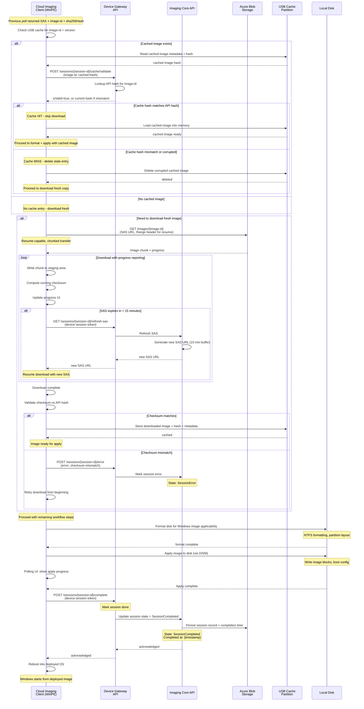

# OS Image Download, Apply, and Session Completion

Device checks cache partition for matching image, validates hash, and either uses cached image or downloads new image. Then formats disk, applies image, and completes session with reboot.

## Download & Retry Semantics

- **Resume-capable**: Ranges supported, client tracks offset
- **SAS refresh**: Auto-refresh if < 15 min remaining
- **Checksum validation**: Against known image manifest
- **Error handling**: On failure, session marked SessionError, client can retry download
- **Progress reporting**: UI updated every chunk (for technician visibility)
