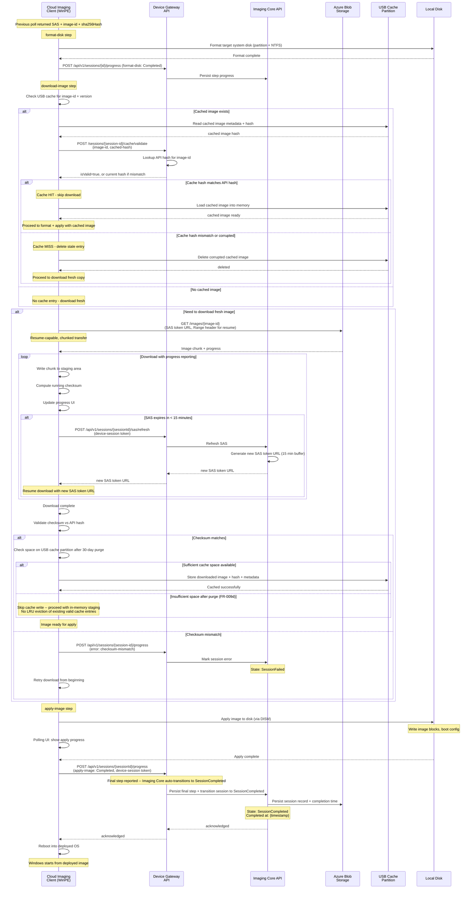

# OS Image Format, Download, Apply, and Session Completion

Device formats the target disk first (format-disk step), then checks cache partition for a matching image and validates its hash. Either uses the cached image or downloads a fresh copy. Then applies the image to the formatted disk and completes the session with a reboot.

## Step Order and Semantics

- **Step order**: format-disk -> download-image -> apply-image (matches ProgressView label order: Format, Download, Apply)
- **Format target**: System disk (device internal drive) formatted before download/apply
- **Download staging**: OS image downloaded to USB cache partition or in-memory staging; not written to the system disk
- **Cache skip**: If insufficient space on USB cache partition after 30-day auto-purge, cache write is skipped and direct staging used; no LRU eviction of valid cache entries (FR-009d)
- **Resume-capable download**: Range headers supported; client tracks byte offset across SAS refreshes
- **SAS refresh**: Auto-refresh if < 15 min remaining on current token
- **Checksum validation**: Downloaded image validated against API-provided SHA256 hash before apply
- **Failure state**: SessionFailed (not SessionError) is the terminal error state; support reference code shown in ResultsView
