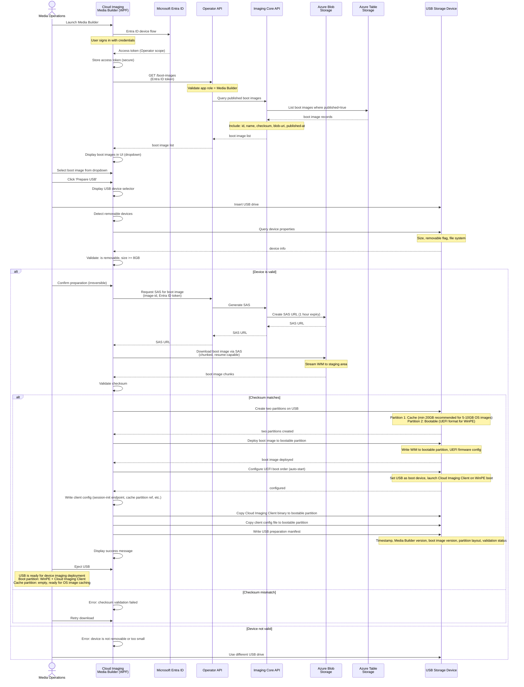

# Media Builder USB Preparation

Media Builder signs in with Entra ID, queries published boot images, downloads via SAS, validates removable disk, and deploys boot image to USB with auto-start config.

## USB Preparation Steps

1. **Device validation**: Removable flag, size >= 8GB, sufficient capacity (32GB+ recommended)
2. **SAS request**: 1-hour expiry for download session
3. **Download**: Chunked, resume-capable transfer
4. **Checksum**: Validate against manifest
5. **Create partitions**: Two partitions on USB (Cache: min 20GB for OS image caching + Bootable: UEFI format for WinPE)
6. **Deploy**: Write WIM to bootable partition
7. **Configure**: UEFI auto-start, client config, preparation manifest
8. **Eject**: Ready for device deployment (boot partition has WinPE + Cloud Imaging Client, cache partition empty)

## Authorization

- **Media Builder app role**: Required to list and download boot images
- **SAS generation**: Operator API validates role before issuing SAS
- **Download**: SAS token limits access to single image for fixed time
