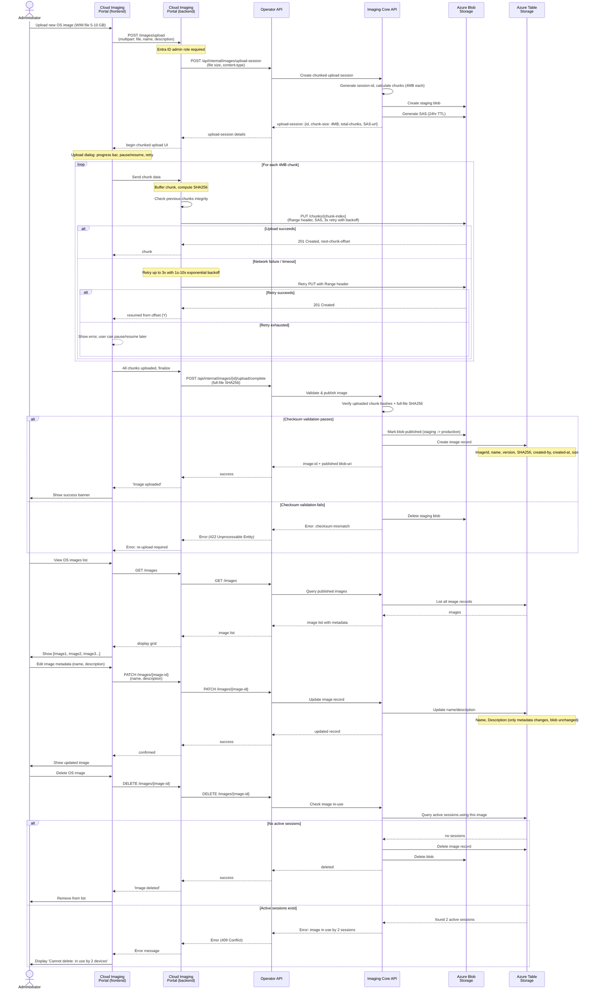

# OS Image Management (CRUD)

Administrator uploads, lists, updates, deletes OS images with in-use guards.

## Image State & Guards

| Operation | Guard | Condition |
|-----------|-------|-----------|
| Create | – | Always allowed |
| Read/List | Published | Only published images visible |
| Update | – | Metadata only, blob immutable |
| Delete | In-use check | Blocked if active sessions reference image |

## Authorization

- **Read/List images**: Any authenticated user
- **Upload**: Admin role only
- **Update**: Admin role only
- **Delete**: Admin role only + in-use guard
