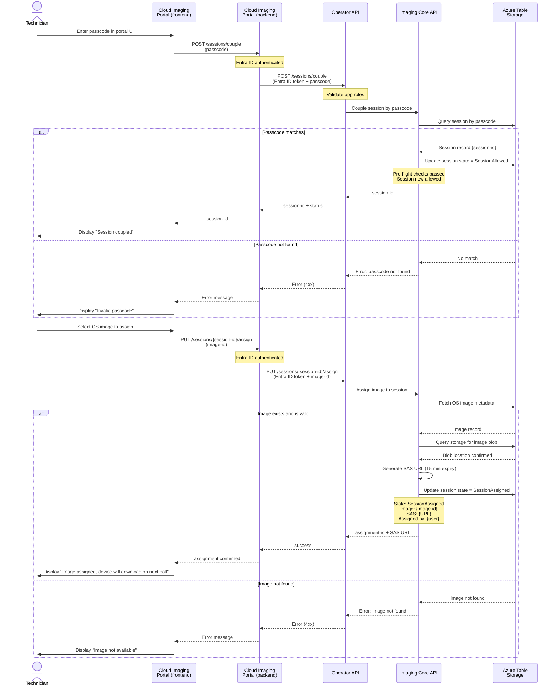

# Session Coupling and Image Assignment

Technician enters passcode in portal, portal couples the session via Operator API, and assigns an OS image for device download.

## Authorization Checks

| Operation | Role Required | Check |
|-----------|---|---|
| Couple session | Technician or Admin | Passcode must be valid |
| View uncoupled sessions | Technician or Admin | Must have session query scope |
| Assign image | Technician or Admin | Image must exist and be published |
| Manage images | Admin only | Requires admin app role |
